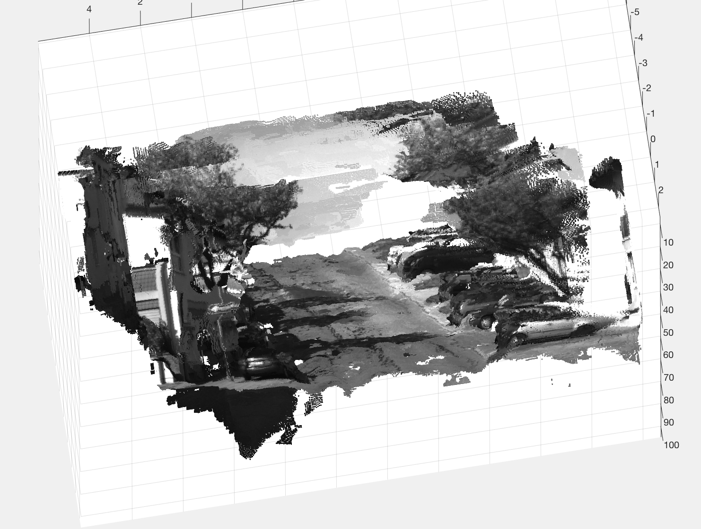
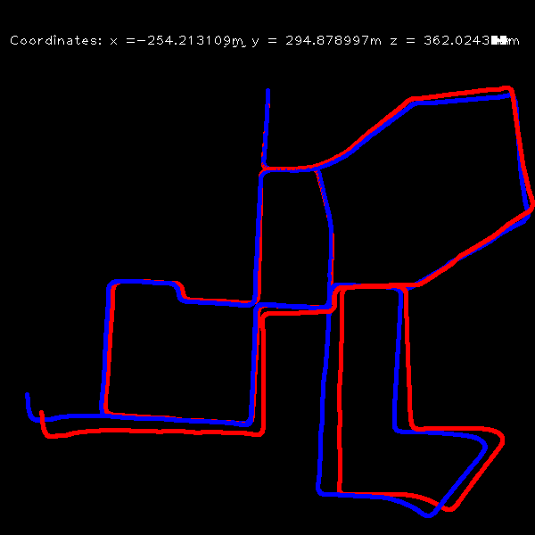

### Requirement
* Python 3.5
* Numpy
* OpenCv

### Introduction

There are currently two files in the src folder,  one is for the 2D-2D mono Visual Odometry and the other one is for 3D reconstruction, the third files is for 3D-2D visual odometry, so you have to initialize the 3D points first as landmarks, and then use landmarks and p3p to find the pose of camera and keep adding new landmarks as time goes.

The dataset tested is from part of Kitty odometry data set.

### Reference
1. [Fall 2017 - Vision Algorithms for Mobile Robotics](http://rpg.ifi.uzh.ch/teaching.html)
2. [Monocular Visual Odometry using OpenCV](http://avisingh599.github.io/vision/monocular-vo/)| Avi Singh
